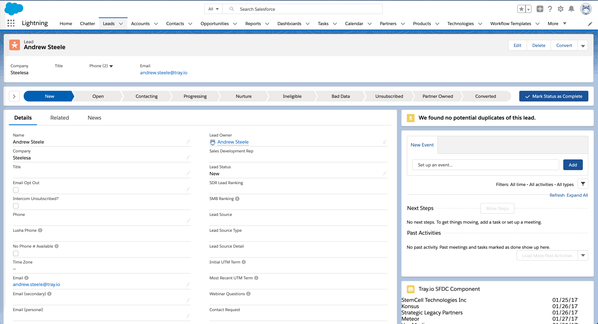
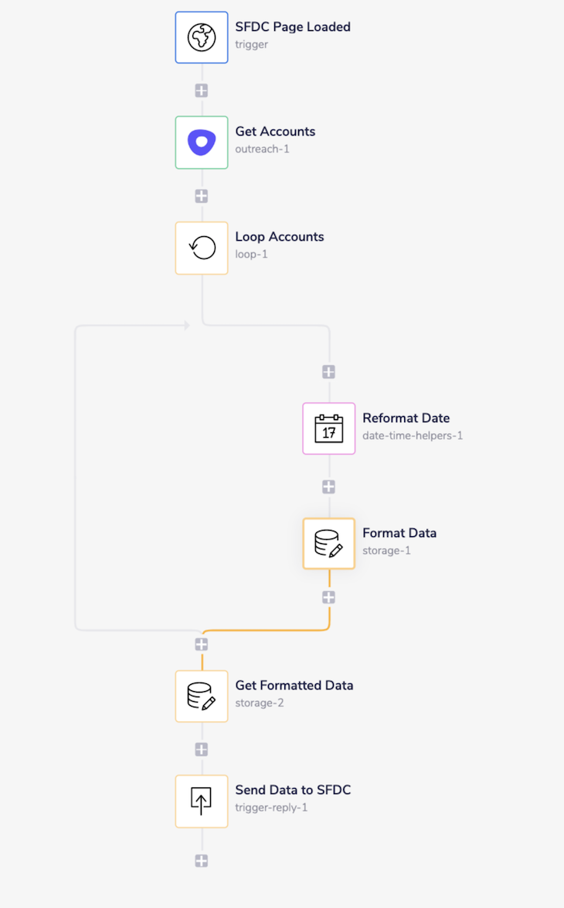

# tray-lightning-component

Lightweight container that can be used to display external data within Salesforce...powered by the Tray.io Platform. This enables Salesforce users to display relevant external data effortlessly in their Salesforce instance without having to actively import the data into their CRM.

## Steps

### Tray.io Configuration

1. Create a Tray.io workflow with a webhook trigger.
2. Save the Webhook Trigger
   - Click the Settings gear on the top left and copy the 'Workflow Public URL' (needed later in Salesforce Configuration).
3. Set the Webhook operation to "When webhook is received, let workflow reply'.
4. Pull any relevant data with any supported Tray connector.
5. Use a 'Trigger-Reply' Connector to send back to Salesforce with the following configuration.
   - Status: 200
   - Body: data: \[ \{data1: _ , data2: _ , data3: _ }, {data1: _ , data2: _ , data3: _ }, etc... \]
   
Example Workflow that imports Account data from Outreach

### Salesforce Configuration

1. Whitelist Tray.io Workflow URL for cross-origin resource sharing (CORS).
   - Go to Setup.
   - Search 'CORS' in the quick find panel.
   - Create 'New' Whitelisted Origin.
   - Enter the Tray.io Webhook URL and save.
2. Add Tray.io Workflow URL as a Content Security Policy Trusted Site.
   - Go to Setup
   - Search 'CSP Trusted Sites' in the quick find panel.
   - Create 'New' Trusted Site.
   - Set 'Trusted Site URL' is set to Tray.io Webhook URL and active is set to true.
3. Add a a custom domain name to your Salesforce URL (required to use custom Lightning Components).
   - Go to Setup.
   - Search My Domain.
   - Follow the instructions given and activate a custom domain.
4. Add Lightning Component Code to Salesforce Environment
   - Click the setup gear in top right and select 'Developer Console'.
   - Create Lightning Component
     - Select File>New>Lightning Component
       - Name TrayLC
       - Copy TrayLC.cmp into file.
       - Click Controller, Helper, and Style on the right bundle panel and copy corresponding code into each file.
     - Select File>New>Apex Class
       - Copy TrayLCController.apcx into file.
   - Save all files.
5. Add Lightning Component to Page Layout.
   - Go to Setup.
   - Search 'Lightning App Builder' in the quick find panel.
   - Either Create a new Record Page or edit an existing page.
   - Drag the TrayLC Custom Lightning Component onto the Builder.
   - Save and enable.
   
